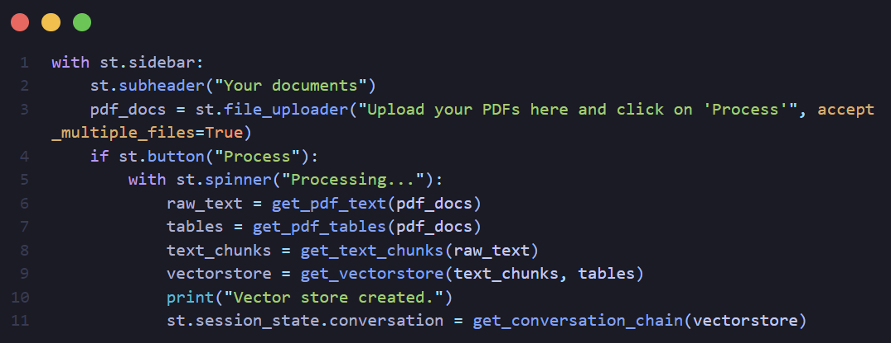
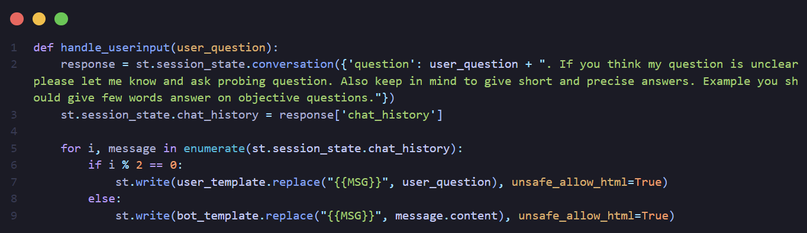

# ChatBot using Ollama 
---
## Table of Contents

- [ChatBot using Ollama](#chatbot-using-ollama)
  - [Table of Contents](#table-of-contents)
  - [Overview](#overview)
  - [Taking PDF Input](#taking-pdf-input)
  - [Handling User Input](#handling-user-input)


---

## Overview

1. This project uses `Ollama` to download the `llama` model and use it to create a chatbot. The chatbot is trained on the `llama` model and can be used to chat with the user. 
2. `HuggingFace` free available models were used to create the embeddings of the input `pdf documents`.
3. The embeddings were then stored in the `Chroma` database which is a `Vector` database. Using this it becomes easier to search for the nearest embeddings and get the response.
4. Then the `llama` model is trained on the data and the chatbot is created.

## Taking PDF Input



1. The user uploads the pdf document.
2. The pdf document is then converted to text using the `pdfplumber` library.
3. The text is then passed to the `HuggingFace` model to get the embeddings.
4. The embeddings are then stored in the `Chroma` database.
5. The different function are used to perform the above tasks and then finally create the conversation chain based on it and train the `llama` model on it.
   1. The vectorstore is passed to the `llama` model and the chain is created.
   2. The chain is created to store the memory of the past chats and result to be displayed to the user.
    ```python
   def get_conversation_chain(vectorstore):
    llm = Ollama(model="llama3")
    memory = ConversationBufferMemory(memory_key='chat_history', return_messages=True)

    conversation_chain = ConversationalRetrievalChain.from_llm(
        llm=llm,
        retriever=vectorstore.as_retriever(),
        memory=memory
    )
    return conversation_chain
    ```
6. 
   1. `RecursiveCharacterTextSplitter` is used to create `chunk` out of the texts of the pdf.
    ```python
    def get_text_chunks(text):
    text_splitter = RecursiveCharacterTextSplitter(
        chunk_size=512,
        chunk_overlap=128,
        length_function=len,
        separators=[" ", ",", "\n", "."]
    )
    chunks = text_splitter.split_text(text)
    return chunks
    ```
   2. An attempt is made to extract `table data` specifically using inbuilt function from the library `pdfplumber`. This resulted is some question getting answered correctly from the table.
    ```python
    def get_pdf_tables(pdf_docs):
    tables = []
    for pdf in pdf_docs:
        with pdfplumber.open(pdf) as pdf_file:
            for page in pdf_file.pages:
                tables.append(page.extract_tables())
    return tables
    ```
   3. In below function, text data and table data is merged together for further processing.
    ```python
    def get_vectorstore(text_chunks, tables):
    # Convert tables into a list of strings
    table_texts = []
    for table in tables:
        for row in table:
            # Flatten the row if it's a list of lists
            if all(isinstance(cell, list) for cell in row):
                row = [item for sublist in row for item in sublist]
            # Filter out None values
            row = [item for item in row if item is not None]
            table_texts.append(' '.join(row))

    # Combine text_chunks and table_texts
    all_texts = text_chunks + table_texts

    if(torch.backends.mps.is_available()):
        device = 'mps'
    elif(torch.cuda.is_available()):
        device = 'cuda'
    else:
        device = 'cpu'

    embeddings = HuggingFaceInstructEmbeddings(model_name="sentence-transformers/all-MiniLM-L6-v2", model_kwargs={'device': device}, encode_kwargs={'device': device})
    
    vectorstore = Chroma.from_texts(texts=all_texts, embedding=embeddings)

    return vectorstore
    ```


## Handling User Input



1. This function is called when user askes a question.
2. The question is passed to the model and the model returns the response stored in the `response` variable.
3. The response is then stored in the `chat_history` to be displayed to the user.
4. The for loop is to display the response and question to the user in respective `html templates`.
5. The part of the question after the user question is added to the model so that the model could potentially learn from the user input and ask a probing question if the details is not enough to answer the user question.


